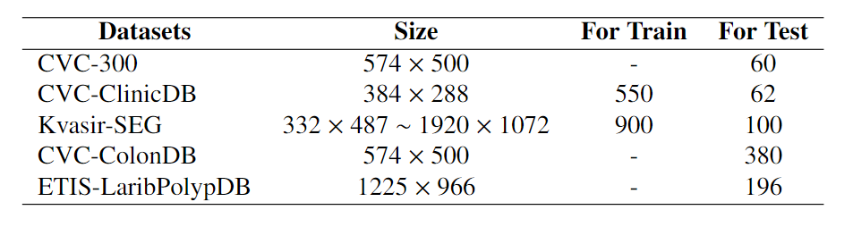
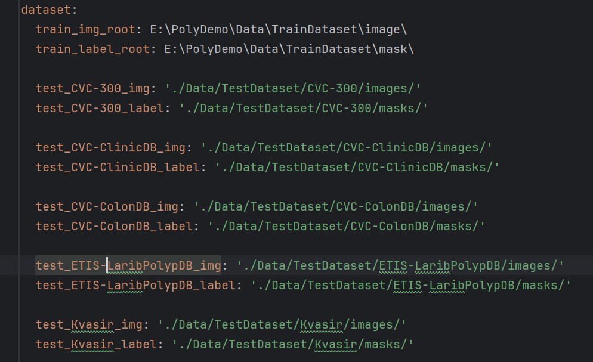

# FMCA-Net: A Feature Secondary Multiplexing and Dilated Convolutional Attention Polyp Segmentation Network Based on Pyramid Vision Transformer

​	Existing polyp segmentation methods have performed well in solving the problems of intra-polyp inconsistency and inter-polyp distinguishability. However, three shortcomings still exist: (1) The decoder does not fully use the initially extracted polyp features. (2) The segmentation edges are fuzzy, and the boundaries are unclear. (3) The network structure is becoming increasingly complex and needs to be clarified. We propose a feature secondary reuse and hole con volutional attention network (FMCA-Net) based on a Pyramid Vision Transformer to solve these problems. Firstly, we propose a feature secondary reuse module (D-BFRM) to process the polyp features of different scales initially extracted in the encoder. After two stages of reuse processing, they are used as references for the remaining branches. This way, feature information such as polyp size, shape, and number can be fully obtained, ensuring the model’s fitting ability. Secondly, we also propose a dilated convolutional attention module group (DCBA\&DCGA), in which DCBA is used to process each branch's features further. In contrast, DCGA processes the final global features to distinguish the boundaries between polyps and backgrounds further and improve the model's overall generalization ability. Finally, we use the idea of modularization in the model to make the structure more concise and clear. We objectively evaluate the proposed method on five public polyp segmentation datasets. The experimental results show that FMCANet has excellent learning and fitting ability and strong generalization ability. At the same time, the idea of modularization also has obvious advantages in the simplicity and clarity of the model structure.

## Installation To get started, you need to install the following dependencies: 

1. Python 3.8+ 
2. PyTorch 1.9.0
3.  torchvision 0.10.0
4. numpy 1.21.2
5. opencv-python 4.5.3.56 
6. scikit-image 0.18.1
7. You can install these packages using pip: ```bash pip install -r requirements.txt ```  （In the requirements file, always list the packages that need to be downloaded）

## Data Preparation  ###

##  ###


## Model Architecture  ###


## Training  ###

1. Run the training script with the following command: ```bash python Train.py ```

## Training logs and checkpoints will be saved in the `runs/` directory.  ###

## Testing and Validation  ###

1. Test the model using the validation dataset: ```bash python Test.py  ``` 
2. Evaluation metrics are calculated in the same way as in Pra-Net
   1. https://github.com/DengPingFan/PraNet

## Performance Metrics  ###

**CVC-ClinicDB Validation MDice**: 0.944 and  - **ETIS-LaribPolypDB Validation Accuracy**: 0.841 

## Contribution Contributions are welcome! If you encounter any issues or have improvements to suggest, please open an issue or submit a pull request. ## 

## Contact For any questions or feedback, feel free to contact the author 